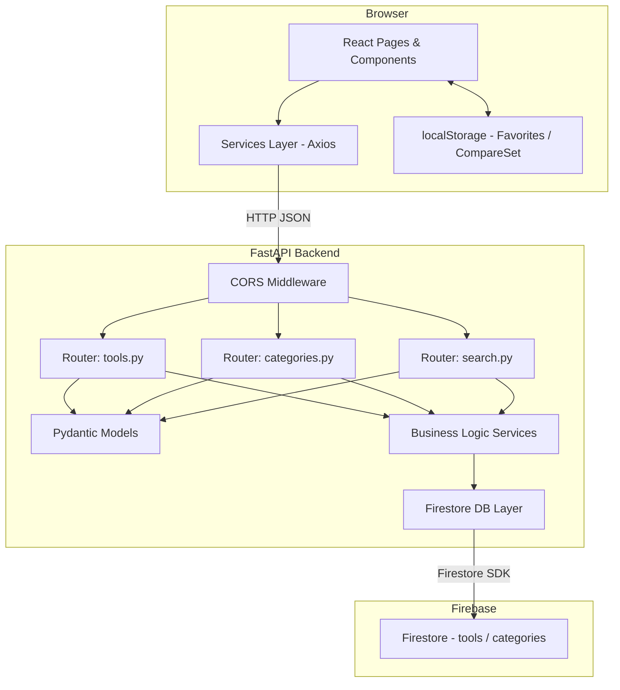

# Design Document: AI Apartment MVP

## Overview

AI Apartment is a web platform for discovering, comparing, and filtering AI tools organized by capability category. The MVP delivers browsing, searching, filtering, tool detail pages, side-by-side comparison, and client-side favorites — all served through a React frontend backed by a Python FastAPI service that reads from Firebase Firestore.

The central design constraint is strict tier separation: the React frontend never touches Firestore or any AI API directly. Every data operation goes through the FastAPI backend. This keeps credentials server-side and gives the backend full control over validation, filtering, pagination, and response shaping.

### High-Level Request Flow

```
Browser (React + Vite)
        │  HTTP/JSON (Axios)
        ▼
FastAPI Backend  (Python)
        │  Firestore SDK
        ▼
Firebase Firestore
```

---

## Architecture

### System Architecture Diagram



### Separation of Concerns

| Layer | Responsibility |
|---|---|
| React Pages | Route-level data orchestration, layout |
| React Components | Pure rendering, event callbacks |
| Services Layer | All Axios calls; no business logic |
| FastAPI Routers | HTTP binding, request validation, response shaping |
| FastAPI Services | Filtering, pagination, search logic |
| FastAPI DB Layer | All Firestore reads/writes; no business logic |
| Pydantic Models | Schema enforcement and serialization |

---

## Components and Interfaces

### Frontend Component Hierarchy

```
App.jsx
└── BrowserRouter
    ├── Layout (persistent nav, comparison indicator)
    │   ├── NavBar
    │   │   ├── SearchBar (persistent)
    │   │   └── ComparisonIndicator
    │   └── <Outlet> (React Router outlet)
    │
    ├── HomePage  /
    │   ├── SearchBar
    │   ├── CategoryGrid → CategoryCard[]
    │   ├── FeaturedTools → ToolCard[]
    │   ├── LoadingSpinner
    │   └── ErrorMessage
    │
    ├── CategoryListPage  /categories
    │   ├── CategoryCard[]
    │   ├── LoadingSpinner
    │   └── ErrorMessage
    │
    ├── CategoryDetailPage  /categories/:categorySlug
    │   ├── ToolCard[]
    │   ├── LoadingSpinner
    │   ├── ErrorMessage
    │   └── EmptyState
    │
    ├── ToolDetailPage  /tools/:toolId
    │   ├── PricingBadge
    │   ├── FreeTierDetails
    │   ├── VerifiedDateBadge
    │   ├── CompareToggleButton
    │   ├── FavoriteToggleButton
    │   ├── LoadingSpinner
    │   └── ErrorMessage
    │
    ├── SearchResultsPage  /search
    │   ├── FilterPanel
    │   ├── ToolCard[]
    │   ├── Pagination
    │   ├── LoadingSpinner
    │   ├── ErrorMessage
    │   └── EmptyState
    │
    ├── CataloguePage  /tools  (browse with filters)
    │   ├── FilterPanel
    │   ├── ToolCard[]
    │   ├── Pagination
    │   ├── LoadingSpinner
    │   └── EmptyState
    │
    ├── ComparePage  /compare
    │   ├── ComparisonTable → ComparisonColumn[]
    │   ├── LoadingSpinner
    │   └── ErrorMessage
    │
    └── FavoritesPage  /favorites
        ├── ToolCard[]
        ├── LoadingSpinner
        ├── ErrorMessage
        └── EmptyState
```

### Reusable Components

| Component | Props | Purpose |
|---|---|---|
| `ToolCard` | `tool`, `showCompare`, `showFavorite` | Summary card used in every listing |
| `CategoryCard` | `category` | Clickable category tile |
| `FilterPanel` | `filters`, `options`, `onChange`, `onClear` | Collects and emits filter state |
| `LoadingSpinner` | `label?` | Shown during any data fetch |
| `ErrorMessage` | `message`, `onRetry?` | Consistent error display with optional retry |
| `EmptyState` | `message`, `cta?` | Zero-result placeholder |
| `PricingBadge` | `pricingType` | Displays exact pricing label with colour coding |
| `FreeTierDetails` | `details` | Structured display of free tier limits |
| `VerifiedDateBadge` | `date` | Shows date, warns if > 90 days old |
| `CompareToggleButton` | `toolId`, `inSet`, `disabled`, `onToggle` | Add/remove from comparison set |
| `FavoriteToggleButton` | `toolId`, `isFavorite`, `onToggle` | Add/remove from favorites |
| `Pagination` | `total`, `limit`, `offset`, `onChange` | Offset-based page controls |
| `ComparisonIndicator` | `count`, `onOpen` | Floating badge showing comparison count |

### Frontend Services Layer (`frontend/src/services/`)

```
services/
├── toolsService.js       # getTools, getToolById, getToolsByCategory
├── categoriesService.js  # getCategories, getCategoryBySlug
├── searchService.js      # searchTools
└── api.js                # Axios instance, base URL from import.meta.env
```

All functions return `Promise<data>` and let the calling page/hook handle loading and error state. No component or page file may call `axios` directly.

### Frontend Hooks (`frontend/src/hooks/`)

| Hook | State Managed |
|---|---|
| `useFavorites()` | Read/write favorites from localStorage |
| `useCompareSet()` | In-memory comparison set (max 4 tools) |
| `useFilters()` | Current filter state and setter |
| `usePagination(total, limit)` | Current offset, page-change handler |

### State Management

**Comparison Set** — stored in React Context (`CompareContext`) so all components share it. Maximum 4 tool IDs. Persisted to `sessionStorage` so it survives page refreshes within the tab.

**Favorites** — stored in `localStorage` under the key `ai_apartment_favorites` as a JSON array of tool IDs, newest-first. Maximum 500 entries. Managed via the `useFavorites` hook.

**Search / Filter / Pagination state** — URL query-string driven (`?q=...&category_id=...&pricing_type=...&page=1`). React Router `useSearchParams` is the single source of truth. This enables shareable, bookmarkable filter views.

---

## Data Models

### Firestore Collections

#### `categories` collection

Each document ID is the category slug (e.g., `image-generation`).

```
categories/{categoryId}
├── name          : string        — display name, e.g. "Image Generation"
├── description   : string        — short description, 1–500 chars
├── slug          : string        — URL-safe identifier matching the doc ID
├── icon          : string | null — icon identifier or URL
└── active        : boolean       — true = visible to users
```

#### `tools` collection

```
tools/{toolId}
├── name              : string        — 1–200 chars
├── description       : string        — 1–2000 chars
├── category_id       : string        — references categories doc ID
├── website_url       : string        — valid URL
├── pricing_type      : string        — enum: "Completely Free" | "Freemium" | "Free Trial" | "Paid Only"
├── free_availability : boolean
├── free_tier_details : object | null
│   ├── credits            : string | null
│   ├── generation_limit   : string | null
│   ├── daily_limit        : string | null
│   ├── monthly_limit      : string | null
│   ├── has_watermark      : boolean | null
│   ├── watermark_details  : string | null
│   ├── feature_restrictions : string | null
│   ├── api_restrictions   : string | null
│   └── commercial_use_allowed : boolean | null
├── capabilities      : string[]      — 0–50 items
├── input_types       : string[]      — 0–20 items
├── output_types      : string[]      — 0–20 items
├── watermark_info    : string | null — 0–500 chars
├── api_available     : boolean
├── best_use_cases    : string[]      — 0–20 items
├── limitations       : string[]      — 0–20 items
├── verified_date     : string        — ISO 8601 YYYY-MM-DD
└── active            : boolean
```

### Pydantic Models (`backend/app/models/`)

```python
# models/tool.py
class FreeTierDetails(BaseModel):
    credits: str | None = None
    generation_limit: str | None = None
    daily_limit: str | None = None
    monthly_limit: str | None = None
    has_watermark: bool | None = None
    watermark_details: str | None = None
    feature_restrictions: str | None = None
    api_restrictions: str | None = None
    commercial_use_allowed: bool | None = None

class ToolRecord(BaseModel):
    id: str
    name: str
    description: str
    category_id: str
    website_url: HttpUrl
    pricing_type: Literal["Completely Free", "Freemium", "Free Trial", "Paid Only"]
    free_availability: bool
    free_tier_details: FreeTierDetails | None = None
    capabilities: list[str] = []
    input_types: list[str] = []
    output_types: list[str] = []
    watermark_info: str | None = None
    api_available: bool
    best_use_cases: list[str] = []
    limitations: list[str] = []
    verified_date: str          # YYYY-MM-DD
    active: bool

class ToolCreate(ToolRecord):
    id: str = Field(default_factory=lambda: str(uuid4()))

# models/category.py
class CategoryRecord(BaseModel):
    id: str
    name: str
    description: str
    slug: str
    icon: str | None = None
    active: bool

# models/responses.py
class PaginatedResponse(BaseModel, Generic[T]):
    data: list[T]
    total: int
    limit: int
    offset: int
```

### Backend Router Structure (`backend/app/routers/`)

```
routers/
├── tools.py      — GET /tools, GET /tools/{tool_id}
├── categories.py — GET /categories, GET /categories/{category_id}/tools
└── search.py     — GET /tools/search
```

### API Contract

All error responses follow `{ "detail": "..." }` or `{ "detail": [{ "loc": [...], "msg": "..." }] }` (Pydantic validation errors).  
All list responses follow `{ "data": [...], "total": N, "limit": N, "offset": N }`.

---

#### `GET /health`

**Response 200:**
```json
{ "status": "ok" }
```

---

#### `GET /categories`

Returns all active categories, sorted alphabetically by name.

**Response 200:**
```json
{
  "data": [
    { "id": "coding-ai", "name": "Coding AI", "description": "...", "slug": "coding-ai", "icon": null, "active": true }
  ],
  "total": 13,
  "limit": 100,
  "offset": 0
}
```

---

#### `GET /categories/{category_id}/tools`

Returns active tools for a category, sorted alphabetically by name.

**Path params:** `category_id` (string)

**Response 200:** `PaginatedResponse[ToolRecord]`  
**Response 404:** `{ "detail": "Category 'xxx' not found" }`

---

#### `GET /tools`

Returns active tools with optional filters and pagination.

**Query params:**

| Param | Type | Default | Validation |
|---|---|---|---|
| `limit` | int | 20 | 1–100 |
| `offset` | int | 0 | ≥ 0 |
| `category_id` | string | — | optional |
| `pricing_type` | string | — | must be one of the four enum values |
| `free_availability` | bool | — | optional |
| `capabilities` | comma-separated string | — | up to 20 values |
| `input_type` | string | — | optional |
| `output_type` | string | — | optional |
| `api_available` | bool | — | optional |
| `has_watermark` | bool | — | optional |

Multiple filters are ANDed. `capabilities` values are ANDed (tool must have ALL specified capabilities).

**Response 200:** `PaginatedResponse[ToolRecord]`  
**Response 422:** Pydantic validation error body when any param is invalid.

---

#### `GET /tools/{tool_id}`

**Path params:** `tool_id` (string)

**Response 200:** `ToolRecord`  
**Response 404:** `{ "detail": "Tool 'xxx' not found" }`

---

#### `GET /tools/search`

**Query params:**

| Param | Type | Notes |
|---|---|---|
| `q` | string | Required, 1–200 chars, non-whitespace |

Search is case-insensitive across `name`, `description`, `category_id`, `capabilities`, and `best_use_cases`. Returns at most 50 active tools ordered by relevance (name match > capability match > description match).

**Response 200:**
```json
{
  "data": [ /* ToolRecord[] */ ],
  "total": 12,
  "limit": 50,
  "offset": 0
}
```
**Response 422:** `{ "detail": "Query parameter 'q' is required and must not be empty" }`

---

#### `POST /tools` (Admin write)

**Body:** `ToolCreate`

**Response 201:** `ToolRecord`  
**Response 422:** Missing required fields or invalid `pricing_type`.

---

#### `PATCH /tools/{tool_id}` (Admin update)

**Body:** Partial `ToolCreate` (only fields to update)

**Response 200:** `ToolRecord`  
**Response 404:** Tool not found.  
**Response 422:** Validation error.

---

### Backend DB Layer (`backend/app/db/`)

```
db/
├── firestore_client.py   — initialises Firestore client from env credentials
├── tools_db.py           — fetch_tools(), fetch_tool_by_id(), write_tool()
└── categories_db.py      — fetch_categories(), fetch_category_by_id()
```

All Firestore queries are encapsulated here. No router or service file calls the Firestore SDK directly.

### Backend Services Layer (`backend/app/services/`)

```
services/
├── tools_service.py      — apply_filters(), paginate(), rank_search_results()
└── categories_service.py — resolve_slug()
```

Business logic (filter intersection, search scoring) lives here, operating on plain Python objects returned by the DB layer.

---

## Correctness Properties

*A property is a characteristic or behavior that should hold true across all valid executions of a system — essentially, a formal statement about what the system should do. Properties serve as the bridge between human-readable specifications and machine-verifiable correctness guarantees.*

### Property 1: Tool serialization round-trip

*For any* valid Tool record object, serializing it to JSON via the Pydantic model and then deserializing the JSON back should produce an equivalent Tool record with all 17 fields intact and unchanged — absent optional fields appear as `null`, not omitted.

**Validates: Requirements 3.1, 3.6**

---

### Property 2: Pagination covers all tools exactly once

*For any* active tool catalogue of size N and any valid page size L (1 ≤ L ≤ 100), iterating through all pages using `GET /tools?limit=L&offset=0`, `offset=L`, `offset=2L`, … until `offset ≥ total` yields exactly N unique tool IDs — no tool appears more than once, and no tool is skipped.

**Validates: Requirements 3.2, 10.9, 10.10**

---

### Property 3: Filter AND semantics

*For any* Filter_Set containing one or more filter parameters, every Tool_Record in the `GET /tools` response satisfies all provided filter conditions simultaneously — for every tool T in the result and every filter F in the Filter_Set, T satisfies F.

**Validates: Requirements 6.4**

---

### Property 4: Capabilities filter is monotonically narrowing

*For any* `capabilities` query containing K values, every Tool_Record returned contains all K capability values in its `capabilities` array. Adding a (K+1)th capability constraint can only reduce or maintain the result set size — never expand it.

**Validates: Requirements 6.5**

---

### Property 5: Search only returns active tools

*For any* search query Q, every Tool_Record in the search response has `active` set to `true` — no inactive tool appears in search results regardless of how well it matches Q.

**Validates: Requirements 5.7**

---

### Property 6: Pricing type label invariant on read

*For any* Tool_Record returned by any API endpoint (`GET /tools`, `GET /tools/{id}`, `GET /tools/search`, `GET /categories/{id}/tools`), the `pricing_type` field is exactly one of the four permitted string values: "Completely Free", "Freemium", "Free Trial", or "Paid Only".

**Validates: Requirements 7.1, 3.1**

---

### Property 7: Pricing type validation on write

*For any* string value V that is not one of {"Completely Free", "Freemium", "Free Trial", "Paid Only"}, a write operation supplying V as `pricing_type` must be rejected with HTTP 422 and a response body that names the invalid value and lists the permitted values.

**Validates: Requirements 3.5, 7.5**

---

### Property 8: Favorites localStorage round-trip

*For any* sequence of add and remove operations on the favorites list, reading the favorites from localStorage returns exactly the set of IDs that were added and not subsequently removed, in newest-first order, with no duplicates, and a total count that never exceeds 500.

**Validates: Requirements 9.2**

---

### Property 9: Favorites capacity invariant

*For any* favorites list already containing 500 tool IDs, attempting to add any additional tool ID leaves the list unchanged at 500 items and produces a user-visible error message.

**Validates: Requirements 9.9**

---

### Property 10: Comparison set capacity and deduplication invariant

*For any* sequence of add/remove operations on the comparison set, the set never contains more than 4 tool IDs and never contains duplicate IDs — attempting to add a 5th distinct ID leaves the set unchanged at 4 items, and adding an ID already present in the set leaves the set unchanged.

**Validates: Requirements 8.1, 8.4**

---

### Property 11: Search case-insensitivity

*For any* search query Q and any case variation Q' of Q (uppercase, lowercase, mixed case), the sets of Tool IDs returned for Q and Q' are identical.

**Validates: Requirements 5.10**

---

### Property 12: Search result field matching

*For any* search query Q and any Tool_Record T returned in the search results, T must have Q appearing (case-insensitively) in at least one of: `name`, `description`, `category_id`, `capabilities` (any element), or `best_use_cases` (any element).

**Validates: Requirements 5.3**

---

### Property 13: Search result count upper bound

*For any* search query Q regardless of catalogue size, the `data` array in the search response contains at most 50 Tool_Records.

**Validates: Requirements 5.11**

---

### Property 14: Inactive tools return 404

*For any* Tool_Record T where `active` is `false`, a `GET /tools/{T.id}` request must return HTTP 404 — inactive tools are never returned via individual lookup.

**Validates: Requirements 3.4**

---

### Property 15: API list response envelope shape

*For any* response from a list endpoint (`GET /tools`, `GET /categories`, `GET /tools/search`), the JSON response body must contain exactly the fields `data` (array), `total` (integer ≥ 0), `limit` (integer), and `offset` (integer ≥ 0) — no list response omits any of these four fields.

**Validates: Requirements 10.10**

---

### Property 16: Verified date staleness flag

*For any* `verified_date` value D that is more than 90 days before the current date, the `VerifiedDateBadge` component must render a staleness warning label. For any date D that is 90 days or fewer before the current date, no staleness warning is rendered.

**Validates: Requirements 7.4**

---

### Property 17: Search input whitespace rejection

*For any* string composed entirely of whitespace characters (spaces, tabs, newlines), submitting it as the `q` parameter to `GET /tools/search` must return HTTP 422 — whitespace-only queries are never processed.

**Validates: Requirements 5.4**

---

## Error Handling

### Backend Error Strategy

| Scenario | HTTP Status | Response Shape |
|---|---|---|
| Resource not found (tool, category) | 404 | `{ "detail": "<resource> '<id>' not found" }` |
| Pydantic validation failure | 422 | `{ "detail": [{ "loc": [...], "msg": "..." }] }` |
| Invalid enum value (pricing_type) | 422 | `{ "detail": "Invalid pricing_type '...'. Must be one of: ..." }` |
| Invalid pagination range | 422 | `{ "detail": "limit must be between 1 and 100" }` |
| Missing required query param (search) | 422 | `{ "detail": "Query parameter 'q' is required and must not be empty" }` |
| Unhandled internal error | 500 | `{ "detail": "An internal error occurred. Please try again." }` |
| CORS violation | 403 | FastAPI default |

Stack traces, module paths, and exception class names are never included in 500 responses. A global FastAPI exception handler catches unhandled exceptions and returns the sanitised 500 shape.

### Frontend Error Strategy

Every data-fetching page uses a consistent three-state pattern:

```
loading → success (render data) | error (render <ErrorMessage onRetry={...} />)
```

- **Loading:** `<LoadingSpinner>` replaces the content area. For tool detail, the spinner appears within 200 ms of navigation.
- **404 from tool endpoint:** `<ErrorMessage>` with "Tool not found" message plus a back-to-browse link.
- **Non-404 errors:** Generic `<ErrorMessage>` — never show partial data.
- **Empty results:** `<EmptyState>` with contextual message and a clear-filters or browse CTA.
- **Search errors:** Preserve the search input text so users can edit and retry.
- **Comparison column errors:** Per-column error in the comparison table; other columns still render.

### Firestore Credential Management

Credentials are never hardcoded. The backend reads them from environment variables defined in `backend/.env`:

```
GOOGLE_APPLICATION_CREDENTIALS=/path/to/service-account.json
FIRESTORE_PROJECT_ID=your-project-id
CORS_ALLOWED_ORIGINS=http://localhost:5173,https://your-domain.com
```

A `backend/.env.example` template is committed to the repository; the actual `.env` is gitignored.

---

## Testing Strategy

### Dual Testing Approach

Unit tests verify specific examples, edge cases, and error conditions. Property-based tests verify universal properties across many generated inputs. Both are necessary for comprehensive coverage.

### Property-Based Testing

The backend business logic layer is a strong candidate for property-based testing because it contains pure filtering, pagination, and search-ranking functions with clear input/output behaviour and a large input space.

**Library:** [Hypothesis](https://hypothesis.readthedocs.io/) for Python backend properties.  
**Library:** [fast-check](https://fast-check.dev/) for JavaScript/React frontend properties.  
**Minimum iterations:** 100 per property test.

Each property test is tagged:

```python
# Feature: ai-apartment-mvp, Property 3: Filter AND semantics
@given(...)
def test_filter_and_semantics(...):
    ...
```

**Backend property tests** (`backend/tests/test_properties.py`):
- Property 1 — Pydantic round-trip using `st.builds(ToolRecord, ...)`
- Property 2 — Pagination covers all tools exactly once using generated catalogues
- Property 3 — Filter AND semantics using generated filter sets and tool lists
- Property 4 — Capabilities AND narrowing (monotonicity)
- Property 5 — Search active-only using catalogues with mixed active/inactive tools
- Property 6 — Pricing type label invariant on all read endpoints
- Property 7 — Pricing type write rejection for any non-enum value
- Property 11 — Search case-insensitivity
- Property 12 — Search result field matching (every result matches query in at least one field)
- Property 13 — Search result count ≤ 50
- Property 14 — Inactive tool returns 404
- Property 15 — API list envelope shape contains data/total/limit/offset
- Property 17 — Whitespace-only search query returns 422

**Frontend property tests** (`frontend/src/__tests__/properties/`):
- Property 8 — `useFavorites` localStorage round-trip using fast-check string arrays
- Property 9 — `useFavorites` capacity invariant: list stays at 500 when full
- Property 10 — `useCompareSet` capacity and deduplication invariant using fast-check add/remove sequences
- Property 16 — `VerifiedDateBadge` staleness flag using generated dates (> 90 days → warning, ≤ 90 days → no warning)

### Unit and Integration Tests

**Backend unit tests** (`backend/tests/`):
- Each router endpoint: success, 404, 422 cases
- `apply_filters()` service: each filter dimension independently
- Search ranking: name match ranked above description match
- CORS: origins from env var are allowed; others rejected

**Frontend unit tests** (`frontend/src/__tests__/`):
- `PricingBadge`: renders each of the four exact labels
- `VerifiedDateBadge`: shows warning for dates > 90 days old, no warning for recent dates
- `FreeTierDetails`: hides when `free_availability` is false
- `FilterPanel`: clear button resets all filters in one interaction
- `SearchBar`: does not submit empty or whitespace-only queries
- `ToolCard`: add-to-compare disabled when comparison set is full (4 items)

### Testing Scope Not Covered by PBT

- **Firestore integration:** tested with 1–3 example-based integration tests against a Firestore emulator, not property tests (external service)
- **UI rendering and layout:** snapshot tests for key components (ToolCard, ComparisonTable)
- **Responsive layout (320–1920 px):** manual verification + snapshot tests at breakpoints
